# OP - Organización de la Producción

## Tema 1 - Los procesos productivos

### 1.1 - Proceso

- Proceso: Conjunto de actividades enlazadas entre si que partiendo de uno o mas inputs los trasforma generando un output.
- Despilfarro: Todo lo que no sea cantidad minima de equpo, materiales, piezas, espacio y tiempo de operario que resulten esenciales para añadir valor al producto.
  - Despilfarro por sobreproducción
  - Despilfarro por tiempos de espera
  - Despilfarro por transporte
  - Despilfarro por proceso
  - Despilfarro por existencias
  - Despilfarro por movimientos
  - Despilfarro por defectos en los productos

### 1.2 - Ingenieria y Procesos

- Ingenieria de Procesos: Define como se fabricaran el producto, que procesos, herramientas y tecnologias seran necesarias.
- Ingenieria de Producto: Funcionalidad, Diseño del producto y tecnologias necesarias para producirlo. I+D
- Ingenieria Concurrente: Ingenieros de producto y procesos trabajan en paralelo.
  - Menos ciclo de desarrollo
  - Menos costes de fabricacion
  - Mayores niveles de calidad

### 1.3 - Tipos de Procesos

- Proceso lineal: Solo existe una linea principal de produccion.
- Proceso convergente: Varias lineas de produccion convergen en una sola.
- Proceso ramificado: Una linea de produccion se divide en varias.
- Proceso compuesto: Se generan bifurcaciones en un punto y luego convergen en otro bien anterior o posterior.

### 1.4 - Distribución en planta

- Distribución funcional (talleres o proceso)
  - Ventajas:
    - Variedad y flexibilidad
    - Posible realizar lotes pequeños
  - Desventajas:
    - Tiempo de proceso largo
    - Cantidad elevada de despilfarros
- Distribución lineal (producto)
  - Ventajas:
    - Tiempo de proceso bajo
    - Cantidad minima de despilfarros
  - Desventajas:
    - Produccion homogenea
    - Mucho volumen de produccion

### 1.6 - Procesos segun la satisfaccion de la demanda

- Formas de satisfacer la demanda:
  - Contra Almacén: La empresa en base a expectativas y conocimientos del mercado decide que, cuando y cuanto producir.
  - Bajo Pedido: La empresa produce a partir de los pedidos recibidos y acuerdos con los clientes.

### 1.7 - El tiempo en los procesos

- Tiempo de ciclo en cada puesto: El tiempo que permanece el producto en cada puesto de trabajo.
- Tiempo de ciclo del proceso: Tiempo que pasa entre la produccion de dos unidades consecutivas.
- Tiempo de proceso: Tiempo total que **una persona** necesita para producir una unidad de producto.
- Lead Time (Tiempo de flujo): Tiempo total necesario para producir n unidades de producto.

### 1.8 - Lote de Proceso

- Lote de proceso: Cantidad de producto que se elaborara en el proceso.
- Lote de trasferencia: Cantidad de producto que se transfiere a la operacion siguiente.

## Tema 2 - Diseño de Procesos de Producción orientados al producto

### 2.1 - Introducción

- La cadena de montaje es un tipo de distribucion en planta donde las maquinas estan colocadas en el mismo orden en el que se fabrica el producto o familia de productos.

### 2.2 - Conceptos

- Takt time: Tiempo de ciclo al que se debe producir para satisfacer la demanda del cliente.
- Capacidad: El inverso del tiempo de ciclo del proceso. La cantidad maxima de producto que un proceso es capaz de producir en un determinado periodo de tiempo.
- Productividad: Mide la cantidad que un proceso puede producir en relacion con los recursos utilizados para ello.

### 2.4 - Equilibrado de lineas de producción

- Una linea se considera equilibrada si utilizando los recursos al maximo la suma de los tiempos libres de la estaciones es lo mas pequeña posible.
- El equilibrado de la linea es el procedimiento de asignar tareas a puestos de trabajo.
- Metodos usados:
  - Hoffman
    - Utiliza siempre la tarea de mayor duracion asignable.
  - Helgeson y Birnie
    - Asigna un peso a cada tarea en base a lo lejos que esta del final del proceso

## Tema 3 - Diseño de Procesos de Producción por Talleres u Orientados al Proceso

### 3.1 - Introducción

- Permite obtener productos variados, flexibles y personalizados, en pequeños lotes.
- Los operarios deben estar bien cualificados en funcion a las maquinas de su zona. Especialistas.
- Baja rotacion de materias primas, bajo ritmo de produccion y tiempos de procesos altos.
- Capacidad y versatilidad de la maquina es elevada para evitar maquinaria duplicada.
- Agrupar las maquinas facilita la familizaricion, supervision, mantenimiento, sustitucion, reparacion y compartir herramientas.
- El tiempo entre operaciones es elevado por el traslado de piezas.

### 3.3 - Metodo de Guerchet

- La superficie de un taller viene dada por la suma de tres superficies:
  - Superficie estatica: Aquella que ocupa fisicamente la maquinaria.
  - Superficie gravitacion: Aquella ocupada por el operario, maquinas y materiales.
  - Superficie de evolucion: Aquella reservada para el movimiento del personal, amteriales y medios de transporte. En funcion de K.

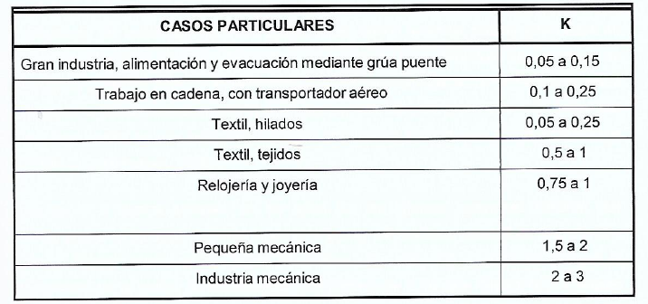

## Tema 4 - Lean Manufacturing

### 4.1 - Introducción

Durante la Segunda Guerra Mundial las fábricas japonesas tenian enormes faltas de material, dinero y personal. Por ello, Toyota, planteo reestructurar su planta de automoviles. Los problemas que se encontro fueron:

- Mercado interior pequeño
- Mano de obra no dispuesta a ser tratada como coste variable o piezas de intercambio.
- Carencia de capital y divisas.
- Mundo exterior con grandes productores de vehiculos.

Toyoda pidio a Taichi Ohno la tarea de desarrollar un sistema que mejorara la productividad de Toyota. La idea básica subyacente en este sistema es minimizar el consumo de recursos que no añaden valor al producto. El sistema creado fue Lean Manufacturing.

- Caracteristicas:
  - Flexibilidad en productos
  - Eliminar despilfarros
- Objetivos:
  - Elevado nivel de productividad
  - Rapidez en la entrega de productos y servicios al cliente.
  - Minimizar los costes
  - Obtencion de productos con un nivel de calidad optimo.
  - Flexibilidad en la empresa para ajustarse a la demanda.

### 4.2 - Principios de Lean Manufacturing

- Valor: El producto o servicio deben ajustarse a las necesidades del cliente.
- El flujo de valor: Planificar el proceso productivo de tal forma que solo incorpore las actividades que añaden valor al producto.
- Flujo: Crear un flujo continuo de actividades creadoras de valor.
- Pull: Proporcionar al cliente los bienes y servicios que realmente quiere, sino tambien darselos cuando realmente los quiere.

### 4.3 - El despilfarro

Hay varias estrategias para atacar el despilfarro:

- Reducir al maximo el inventario.
- Reducir al maximo los WIP (Work in Progress).
- Reducir los tamaños de lotes de produccion.
- Reducir los tiempos de ajustes usando SMED.
- Minimizar el tiempo de inactividad de las maquinas.
  - Hacer mantenimiento preventivo.
- Minimizar tiempos de transporte.
  - Utilizar layout en celulas para asegurar el flujo continuo.
- Minimizar defectos y desechos. Por ejemplo usando TPM (Total Productive Maintenance).

### 4.4 - Beneficios esperados

- Reduccion del lead time
- Reduccion de stocks en curso
- Aumento de la productividad
- Disminución del espacio necesario
- Disminucion de los costes de no calidad
- Aumento de la flexibilidad

### 4.6 - Tecnicas Lean

- JIT: Just in Time
- TQM: Total Quality Management
- TPM: Total Productive Maintenance
- SMED: Single Minute Exchange of Die
- Kanban: Sistema de tarjetas
- Kaizen: Mejora continua
- Jidoka: Identificar y eliminar errores lo antes posible
- Poka Yoke: Sistema de deteccion de errores automatico
- Seis Sigma: Estrategia de mejora de procesos

## Tema 5 - Diseño de Almacenes

### 5.1 - Introducción

- Desarrollar un Layout adecuado para el tratamiento eficaz de los procesos operativos (entrada y salida de productos).

### 5.2 - Tipos de Almacenes

- Almacenes industriales: Almacenes de materias primas, componentes o semielaborados.
- Almacenes comerciales: Productos terminados.
  - Almacenes de productos terminados: Anexas a la fabrica para almacenar productos terminados.
  - Almacenes centrales o reguladores: Recogen tanto productos, como importaciones como devoluciones. Centro de consolidacion de productos.
  - Almacenes regionales: Pequeños stock para una zona o region.
  - Centros de recogida de productos: Para devoluciones o reparaciones.
  - Plataformas de distribucion: Para la distribucion al cliente o puntos de ventas.

### 5.3 - Caracteristicas de los productos

- Caracteristicas fisicas:
  - Volumen y peso
  - Empaquetamiento
  - Fragilidad y resistencia
  - Identificacion fisica
  - Peligrosidad
  - Condiciones ambientales requeridas
- Caducidad y obsolescencia
  - Productos de larga duracion
  - Productos perecederos
  - Productos de caducidad fija
  - Riesgo de obsolescencia
- Operatividad
  - Condiciones de seguridad, manipulacion...
  - Sistemas de codificacion: codigos de barras, RFID...
  - Unidad de manipulacion: Palets, cajas, unidades...
  - Unidad minima de venta
  - Seguimiento del sistema: FIFO, LIFO...
- Caracteristicas de la demanda
  - Articulos de alta o baja rotacion
  - Articulos estacionales
  - Articulos de alto o bajo coste
  - Prioridades de servicio

### 5.4 - Principios de organizacion de almacenes

- Maximizar el espacio disponible
- Minimizar las operaciones de manipulación y transporte interno

#### 5.4.1 - Regla 20/80

- El 20% de los productos representan el 80% del volumen de ventas.
- Clasificamos los productos en tres grupos:
  - A: articulos con un indice de actividad alto
  - B: articulos de actividad media
  - C: articulos de actividad lenta
- Cuanto mayor sea el indice mas cerca de la zona de expedicion y cerca del suelo para facilitar la manipulacion.

#### 5.4.2 - Sistemas de posicionamiento y localizacion

- Sistema de posicion fija: Cada producto tiene un lugar fijo.
  - En sistemas manuales facilita la localizacion e identificacion de productos.
  - Permite asignar al articulo un numero de ubicacion que nos facilite su identificacion y localizacion
  - Mayor requerimiento de espacio
  - Dificultad de mantenimiento del sistema y falta de flexibilidad
- Sistema de posición aleatoria: Los productos se ubican en cualquier hueco libre.
  - Reducción del espacio necesario
  - Con sistemas automatizados se consigue un alto rendimiento
  - Mayor flexibilidad y facilidad de mantenimiento
  - Recomendable en sistemas automatizados

### 5.5 - El Lay-out de los almacenes

- Areas:
  - Area de almacenaje
  - Area de manipulacion del producto:
  - Area de carga y descarga de vehiculos:
  - Area de servicios internos
  - Areas de servicios externos

#### 5.5.1 - Distribucion en planta del flujo de materiales

- Flujo en U: Recorrido semicircular, forma de U
  - Unificacion de muelles
  - Mayor facilidad en la ampliacion y o adaptacion
  - 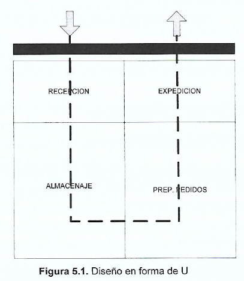
- Flujo en Linea Recta:
  - Dos muelles, uno de carga y otro de descarga
  - Permite usar diferentes tipos de vehiculos
  - 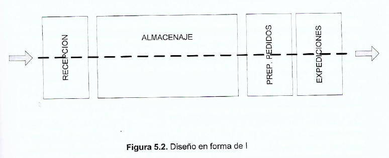
- Flujos en T:
  - Variante de la forma U
  - 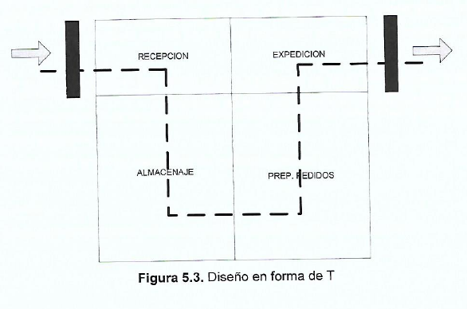

### 5.6 - Calculo de la capacidad requerida

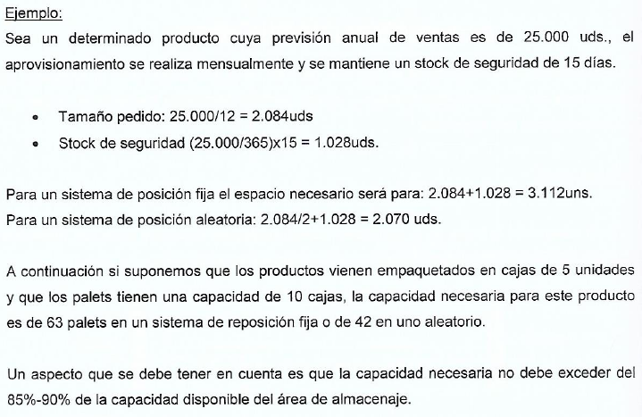

### 5.7 - Sistemas de almacenaje

- El pallet es el medio de contención de la industria.
  - 800x1000mm
  - 1000x1200mm

- Almacenamiento en Bloque
  - Los productos se apilan uno encima del otro.
  - Ventajas:
    - Sistema compacto
  - Desventajas:
    - Posible deterioro de los productos.
    - Dificultad de rotacion de productos.
    - Dificultad en el recuento y control del producto.
- Estanterías convencionales de palets.
  - Sistema clasico: pasillo - estanteria - pasillo.
  - Ventajas:
    - Accesibilidad a cada pallet.
    - Adecuado para almacenes de muchas referencias y poco stock.
    - Flexible para soportar campañas de ventas.
  - Inconvenientes:
    - Poco aprovechamiento del suelo.
- Sistemas compactos o Drive-In
  - En estos sistemas las estanterias forman calles y manipula los productos mediante carretillas.
- Estanterias Dinamicas
  - Parecido al sistema compacto pero los pallets se deslizan por gravedad o motores sobre rodillos.
  - Desventajas:
    - Requiere pallets especiales.
    - Coste elevado de instalacion.
    - Dispone de menos huecos para picking.
- Estanterías moviles
  - En este sistema solo existe un pasillo y se desplazan las estanterias para crearlo y poder acceder a los productos.

### 5.8 - Equipos de manutención

- Transporte horizontal
  - Transpaletas
    - Transpaletas manuales
    - Transpaletas electricas dirigidas a pie
    - Transpaletas autopropulsadas en las que el operario va montado.
  - Rodillos: manuales, por gravedad o motorizados.
  - Cintas o cadenas transportadoras
  - Carretillas autodirigidas (sin conductor)
- Transporte vertical
  - Elevadoras convencionales
    - Pasillos de 3 a 3,5m
    - Llegan a 5, 6m de altura
  - Elevadoras retráctiles
    - Las pinzas tiene movimiento de extensión y retracción para poder recoger el pallet sin mover el vehiculo.
    - Pasillos reducibles a 2,5m
  - Maquinas trilaterales
    - Recoge de forma retractil desde los laterales como desde el frontal.
- Transporte horizontal y vertical
  - Puentes grua
  - Polipastos

## Tema 6 - Gestión de Stocks de Demanda Independiente

### Tema 6.1 - Naturaleza de los stocks

- Se creo para satisfacer una demanda constante de productos.

### Tema 6.2 - Costes de los stocks

- Coste de inmovilizacion de capital
- Coste de mantenimiento del almacen
- Coste de manutencion
- Coste de deterioro
- Coste de caducidad

### Tema 6.3 - Tipos de demanda

- Demanda independiente: Solo se ve afectada por el mercado.
  - Bicicleta
- Demanda dependiente: Depende de la fabricacion de otros productos.
  - Ruedas de bicicleta

### Tema 6.4 - Calculo de lote economico

- Realizar un solo pedido
  - Coste de pedido pequeño
  - Coste de almacenaje grande
- Realizar muchos pedidos
  - Coste de pedido grande
  - Coste de almacenaje pequeño
- El coste minimo se dara cuando la derivada de la suma de ambos costes sea nula.
- 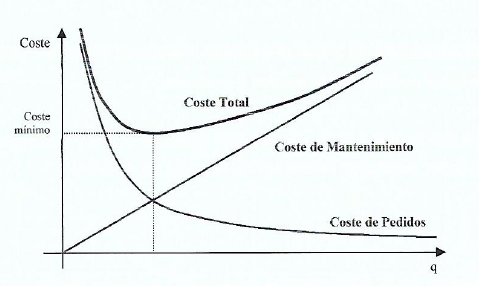

### Tema 6.5 - Sistemas de control de inventarios

- Sistema de revision continua (Sistema Q)
  - Se revisa continuamente el stock y al bajar de cierta cantidad se realiza un pedido.
  - La cantidad a pedir es q, que es el tamaño del lote economico.
  - 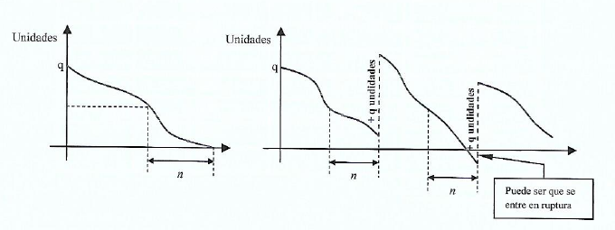
- Sistema de revision periodica (Sistema P)
  - Se establece un tiempo P entre revisiones
  - Tambien se establece T que es el nivel objetivo de inventario, es decir, lo que nos marca la cantidad de producto a pedir.
  - 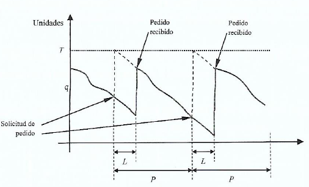

## Tema 7 - Introduccion a la Planificacion de la Produccion

### 7.1 - Introduccion

- El objetivo de la planificacion de la produccion es satisfacer la demanda al menor coste posible y con el maximo beneficio para la organizacion.

### 7.2 - Niveles de Planificacion

- Planificacion de Ventas y Operaciones (Planificacion agregada)
  - Tomar decisiones en base a la estimacion de ventas normalmente de un año para atender la demanda.
- Planificacion Maestra de la Produccion (PMP)
  - Maximo 12 semanas
  - Dicta que articulos, que cantidad y cuando se produciran.
  - Productos especificos
- Planificacion de las Necesidades de Materiales (MRP)
  - Indica en que momento se mandan las ordenes de fabricacion y de compra ademas de la cantidad para hacer los productos detallados en el PMP.
- Planificacion a corto plazo
  - Suele ser semanal
  - Programa de fabricacion de cada maquina y operario.
  - Más complejo.

### 7.3 - Tipos de Planificacion

- Contra stock
  - Se produce de forma continua y se almacena para ir entregando al cliente.
  - 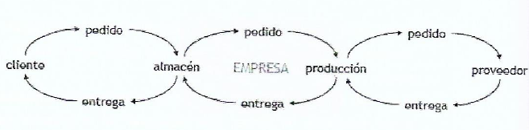
- Contra pedido
  - Se fabrica segun peticiones de los clientes.
  - 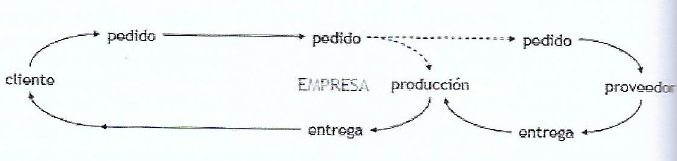

## Tema 8 - Planificación de ventas y operaciones

### 8.1 - Objetivos de la planificación de ventas y operaciones

- En base a un pronostico de ventas garantizar una correcta atencion de la demanda.
- Esto aporta informacion sobre:
  - Niveles de inventario
  - Recursos humanos
    - Numero de personas
    - Tiempo de trabajo
  - Niveles de produccion
  - Necesidades de capital

### 8.2 - Diseño general de la planificación de ventas y operaciones

- Trabajamos con "familias de productos"
  - Aunque una mesa sea diferente si los recursos necesarios son los mismos se considera la misma familia.
  - De esta forma los pronosticos de demanda son más precisos.
  - Tambien se consideran unidades de tiempo más grandes lo que da mejores resultados.

### 8.3 - Estrategias para la planificación de ventas y operaciones

- Nivelación
  - Consiste en establecer un nivel determinado de recursos para producir lo mismo cada día.
  - 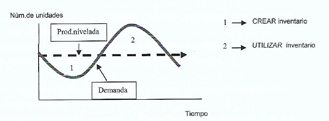
- Persecución
  - Se basa en producir en cada periodo de tiempo establecido la previsión de las ventas
  - 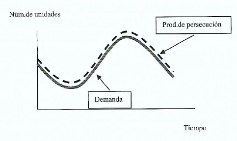
- Mixta
  - El más empleado.
  - Consisten en modifical la demanda y los recursos de manera que se maximice el desempeño de la organización
  - 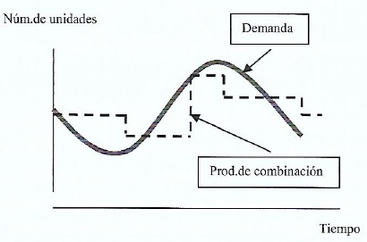

### 8.4 - Balance de recursos en la planificación de ventas y operaciones

- Estrategias internas
  - Contratar y despedir
  - Trabajadores temporales
  - Subcontrataciones
  - Inventario
  - Cartera de pedidos
  - No atender la demanda
- Estrategias externas
  - Fijar precios: Regula la demanda
  - Promociones
  - Publicidad

## Tema 9 - Programación Maestra de la Producción

### 9.1 - Objetivos de la Planificación Maestra de la Producción

- El objetivo es determinar que articulos finales se deben fabricar y en que cantidades y periodos de tiempo.

### 9.2 - Horioznte temporal

- Como maximo 12 semanas.
- Es muy importante que el horizonte temporal sea igual o superior que el tiempo de espera del producto que se esta planificando.

## Tema 10 - MRP (Material Requirements Planning)

### 10.1 - Introduccion

- El MRP es la planificacion de las necesidades de materiales.
- Cuando debemos comenzar a fabricar y comprar.

## Tema 11 - Planifiacion de la Capacidad

### 11.1 - Introduccion

- Todo plan maestro de producción debe comprobarse para ver si es realizable con los recursos disponibles. Para ello usaremos CRP (Capacidad de Requerimientos de Producción) o MRPII (Manufacturing Resource Planning).

### 11.4 - CRP - MRP II

Utilizando la tabla de lanzamientos de todas las ordenes de fabricacion más la tabla con los tiempos de procesamientos de cada componente o producto final en cada centro de trabajo.

## Tema 12 - Programación de la Producción

### 12.1 - Introduccion

- La Programacion de Operaciones define ¿Donde? ¿Cuando? ¿Como? ¿Quien?

### 12.2 - Programación y control de la producción en sistemas de fabricación intermitente

- Sistema de fabricacion intermitente: Aquel en el que los productos pasan a traves de los centros de trabajo en lotes a pedidos individuales o en agrupaciones de pedidos individuales.
  - Diversidad de productos
  - Flexibilidad
  - Maquinas versatiles
  - Costes de cambio elevados
  - Grandes inventarios en curso
  - WIP elevado
  - Mano de obra cualificada y flexible

- Talleres de Trabajo o Mecanicos
  - Centros de trabajo que desarrollan distintas funciones
  - Fabrican solo bajo pedido
- Talleres de Flujo
  - Centros de trabajo donde se desarrollan varias funciones distintas de forma sucesiva.
  - Suelen trabajar contra almacén

#### 12.2.1 - Etapas

- La programacion y control de la produccion es el plan que preve coordina y gestiona medios y trabajos de manera detallada y a corto plazo. Para ello considera el MRP, la capacidad de los centros de trabajo y el WIP menor posible.
- Tiene tres etapas:
  - Programación: Asignacion de trabajo a un medio y la especificacion del orden y momento en el que se debe realizar
    - Criterios:
      - Nivel de servicio
      - Coste minimos
    - Fases:
      - Se parte de las ordenes de fabricacion
      - Se realiza el MRP II
      - Dado la poca exactitud del MRP II por el uso de medias se realiza otras estimaciones para comprobar realmente si es factible a nivel operativo.
      - Se determina las necesidades.
      - Se toman los ajustes necesarios en base a esas necesidades.
      - Se secuencian las maquinas.
      - Se desarrolla el programa detallado.
  - Lanzamiento
    - Es la accion de ordenar al operario la ejecucion de las tareas siguiendo los establecido en la programacion.
  - Control
    - Se obtiene informacion sobre la produccion y se compara con lo planificado por si hay que realizar ajustes.

### 12.3 - Carga o Asignacion

- Los procedimientos de carga puedes ser
  - Finitos: Dependen de la capacidad de los centros de trabajo.
  - Infinitos: No dependen de la capacidad de los centros de trabajo.
- Es necesario conocer el orden de las operaciones para poder asignarlas correctamente de forma sucesiva.
- Tambien necesitamos estandares de tiempo para determinar el tiempo total de las operaciones.
- Tambien es necesario la disponibilidad de herramientas y materiales.
- Metodos de resolución
  - Metodo de los indices con/sin división

### 12.4 - Secuenciacion

- Los problemas de secuenciación estan asociados al problema de la escasez.
- Se debe elegir el orden en el que se realizan las operaciones porque tenemos recursos limitados.

- Planteamientos optimizadores frente a planteaminetos heuristicos
  - No es posible encontrar una solucion optima debido a la complejidad de los problemas.
  - Los metodos existentes solo funcionan en problemas muy pequeños y concretos.
  - Es por ello que se usan metodos heuristicos.
- Evaluación de las soluciones a un problema de secuenciación
  - Minimizar el tiempo de flujo
  - Minimizar las entregas tardias

- Terminologia
  - Tiempo de procesamiento es la duracion de la operacion
  - Tiempo de espera es el tiempo que el trabajo esta en la cola esperando a ser procesado
  - Fecha de llegada es el instante en el que el trabajo llega al taller
  - Fecha de finalizacion corresponde al instante en elq ue se termina la ultima operacion
  - Fecha de entrega es el instante en elq ue hay que entregar el trabajo

- Reglas de prioridades
  - FIFO (First In First Out)
  - SPT (Shortest Processing Time)
  - LPT (Longest Processing Time)
  - EDD (Earliest Due Date)
  - Holgura minima: Los que son mas posibles de retrasarse primero

## Tema 13 - Teoria de las limitaciones

### 13.1 - Introduccion

- Goldratt expone que debemos basarnos en variables financieras para tomar decisiones.
  - Beneficio neto: Nos informa de lo que hemos ganado o perdido.
  - Rentabilidad: Relacion entre el dinero ganado y el invertido.
  - Liquidez: Dinero disponible en la caja.
- Goldratt plantea como puede saber el Director de Produccion si la decisiones estan aumentando el beneficio neto, la rentabilidad y la liquidez. Para ello plantea tres parametros.
  - El Ingreso Neto (Throughput): Dinero generado a través de las ventas
  - El Inventario: Dinero invertido en comprar cosas que se venden
  - Los Gastos Operativos: Dinero gastado para convertir el inventario en Throughput
- Por lo tanto el Beneficio es Throughput - Inventario - Gastos Operativos

### 13.2 - Teoria de las limitaciones (T.O.C)

- Dos caracteristicas fundamentales
  - Estructura piramidal
    - Se buscan optimos globales, para la empresa, no tienen porque ser locales.
    - El rendimiento de la empresa es el rendimiento del eslabon mas debil.

### 13.3 - Reglas de la T.O.C

- No se debe equilibrar la capacidad productiva de una planta sino el flujo de produccion
- La utilizacion de un recurso que no es cuello de botella no viene determinada por su propia capacidad, sino por alguna otra limitacion del sistema.
  - Un no cuello de botella atiende a un cuello de botella.
    - Se genera un stock intermedio delante del cuello de botella y la produccion se ve limitada por el cuello de botella.
  - Un cuello de botella atiende a un no cuello de botella
    - No se genera stock intermedio pero la produccion se ve limitada por el cuello de botella igualmente.
  - Se ponen en parallelo
    - Para lo mismo que en el primer caso
- Utilización y Activación de un recurso no son sinonimos
  - Utilizar es consumir recursos
- Una hora perdida en un cuello de botella es una hora perdida en todo el sistema
- Una hora ganada en un no cuello de botella es un espejismo
- Los cuellos de botella rigen tanto el inventario como la facturación del sistema
- El lote de transferencia puede no ser, y de hecho, muchas veces no debe ser igual al lote de proceso.

### 13.4 - Marcha de Boy Scout

- Goldratt dice que un sistema de fabricación se asemeja a una marcha de boy-scout. En una de estas la fila intenta siempre tener la misma longitud pero bien por la velocidad diferente de los niños o por sucesos inesperados la fila se puede llegar a alargar. Por ello, para mantener la fila constante, los sargentos usan el sistema DBR (Drum-Buffer-Rope).
- Drum: La velocidad de la marcha, el cuello de botella.
- Buffer: Las maquinas delante del cuello de botella no deben parar nunca por lo que necesitamos un colchon de seguridad.
- Rope: Atar con una cuerda el cuello de botella con el primero de la fila. De esta forma no se generan stocks intermedios.
